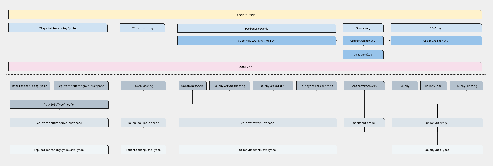

*The colonyNetwork repository is developed as free software; if you are interested in contributing, or want to report an issue or bug, please see the [GitHub repository.](https://github.com/JoinColony/colonyNetwork)*

The Colony Network is a large set of contracts that together define how all colonies operate and interact with people and other smart contracts on the Ethereum blockchain.

Colony is designed to be modular, upgradable, and eternally backwards-compatible. This is achieved through a sophisticated contract architecture that requires a bit of exposition. It is recommended that any developer seeking to understand the Colony Network solidity implementation first read the [Colony White Paper](https://colony.io/whitepaper.pdf), or at the very least, the [White Paper TL;DR](/colonynetwork/whitepaper-tldr-colony/).

## Overview of Contracts
Broadly speaking, the Colony Network contracts can be divided into a few categories:

* Core contracts that facilitate upgrades, versioning, and emergency functions
  * `EtherRouter.sol`
  * `Resolver.sol`
  * `ContractRecovery.sol`
  * `ContractEditing.sol`

* Interface contracts that collate and register public functions on the network.
   * `IColony.sol`
   * `IMetaColony.sol`
   * `IColonyNetwork.sol`
   * `IReputationMiningCycle.sol`
   * `ITokenLocking.sol`
   * `IRecovery.sol`

* Authority contracts that define who can call which registered functions.
   * `CommonAuthority.sol`
   * `ColonyAuthority.sol`
   * `ColonyNetworkAuthority.sol`

* Colony contracts that define the state of an individual colony, such as funding pots, tasks, domains, and skills.
   * `Colony.sol`
   * `ColonyFunding.sol`
   * `ColonyPayment.sol`
   * `ColonyTask.sol`
   * `ColonyStorage.sol`
   * `ColonyDataTypes.sol`
   * `DomainRoles.sol`

* Network contracts that define a global state shared by all colonies, such as reputation, token auctions and ENS.
    * `ColonyNetwork.sol`
    * `ColonyNetworkAuction.sol`
    * `ColonyNetworkENS.sol`
    * `ColonyNetworkMining.sol`
    * `ColonyNetworkStorage.sol`
    * `ColonyNetworkDataTypes.sol`

* Reputation Mining contracts that define a consensus protocol for validators of the global reputation state.
    * `ReputationMiningCycle.sol`
    * `ReputationMiningCycleDataTypes.sol`
    * `ReputationMiningCycleStorage.sol`
    * `ReputationMiningCycleRespond.sol`

* Token contracts that define the CLNY token.
    * `TokenLocking.sol`
    * `TokenLockingStorage.sol`
    * `TokenLockingDataTypes.sol`

* Extension contracts that allow for custom, legacy, or modified extention contracts to be added to a colony
    * `ExtensionFactory.sol`
    * `OldRoles.sol`
    * `OldRolesFactory.sol`
    * `OneTxPayment.sol`
    * `OneTxPaymentFactory.sol`

* ENS contracts that define a custom ENS registry for use with colonies and the Colony Network
    * `ENS.sol`
    * `ENSRegistry.sol`

## Inheritance Architecture
The Colony Network contracts are separated out into functional layers, and named according to their context.

Starting from the lowest level, all data types are declared in a DataTypes contract.

All storage variables are declared and stored in a storage contract, which inherits a DataTypes contract.

The actual logic of functions is implemented in separate contracts, which inherit a storage contract. All functions which are implemented in this layer must only modify storage varibles declared in the appropriate storage contract.

Finally, all public functions are composed from all logic contracts into a single interface contract, which is used to register functions with EtherRouter (see the next section).
