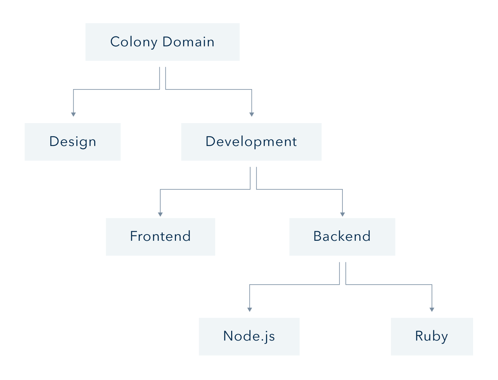

Domains and Skills are concepts that define a colony's organizational structure in a decentralized context, and allow for the division of labor without a strict management hierarchy.

Domains are a structure for compartmentalizing the work and shared resources of a colony into smaller, more specialized sub-groups which are analogous to the departments of a traditional company.

Skills are a similar structure that categorize the _type_ of work done, independent of the domain or colony in which the work took place.

==TOC==

## Domains
Like a file system that contains files and sub-folders, any domain can contain tasks, sub-domains, or both.

With the exception of the top-level colony domain, which contains all tasks and sub-domains, every domain in a colony belongs to a larger parent domain.

Every domain has an associated [pot](/colonynetwork/whitepaper-tldr-pots-and-funding/) which can receive funding (in most circumstances from the parent domain's pot).

Tasks are tagged with a `DomainId` that specifies which domain they belong to. When a member of a colony earns internal tokens as a result of a completed task (Managers, Workers, and Evaluators all earn reputation from task completion), they earn reputation in that domain as well as all parent domains, including the colony-wide domain. They do not earn any reputation in child domains.

A well-organized domain hierarchy is one way to isolate and compartmentalize work within a colony: In the Colony Protocol, reputation mediates the flow of funding from parent domains to their children (see [pots](/colonynetwork/whitepaper-tldr-pots-and-funding/) for more about funding), which may in turn direct funding toward smaller and more specialized or specific child domains or tasks. In version 1 of the colonyNetwork, however, the flow of funds between domain pots is permissioned based on [colony roles](/colonyjs/topics-colony-roles/).

## Skills
Skills do not exist within a particular colony, but instead are a single structure available to all colonies on the network. The global skill hierarchy is maintained by [The Meta Colony](/colonynetwork/whitepaper-tldr-the-meta-colony-and-clny/).

Tasks are tagged with a `SkillId` that specifies a skill from the global skill hierarchy. When a member of a colony earns internal tokens for completing a task, they earn reputation in the skill, as well as all parent skills. They do not earn any reputation in child skills.

Even though the global set of Skills is shared by all colonies, reputation earned in a particular skill only affects an individual's influence over the colony in which the reputation was earned.

Skill tags are meant to provide a more fine-grained categorization of work than domains, allowing for tasks within the same domain to be further differentiated.

See the colonyJS [colonyClient API](/colonyjs/api-colonyclient/) for implementation details.

## Disputes
Domains and Skills determine the scope of voting in the event of a dispute or collective decision.

In Colony you cannot escalate a decision to higher management, you can only escalate to bigger groups of your peers. Domains and Skills mediate this behavior.

When an objection is raised, the objector must specify at least one domain or skill which should vote on the issue in the event of a dispute. All members within the specified domain/skill will then carry out a reputation-weighted vote to settle the dispute. If the results of the vote are disagreeable to a sufficient amount of collective reputation, the dispute may be escalated to a parent domain and/or skill with a subsequent round of objection/dispute.

Because of the recursively-awarded reputation in parent domains/skills, an individual will always have the same absolute voting power as a dispute is escalated, but of course will have diminishing proportional voting power as the dispute involves more and more participants.

See [Objections and Disputes](/colonynetwork/whitepaper-tldr-objections-and-disputes/) for more information about the complete dispute resolution process as described in the Colony whitepaper.
